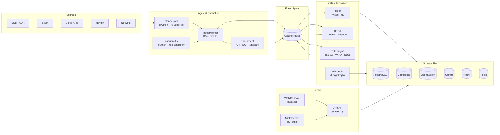

<div align="center">


# AiSOC

An AI-powered Security Operations Center (SOC). The agent's prompts, tool calls, and rationale are logged step-by-step and replayable.

[](CHANGELOG.md)
[](https://github.com/yashvinthan/aisoc/actions/workflows/ci.yml)
[](https://github.com/yashvinthan/aisoc/actions/workflows/codeql.yml)
[](https://github.com/yashvinthan/aisoc)

[](https://codespaces.new/yashvinthan/aisoc?quickstart=1)
[](http://localhost:3000/dashboard)

<sub>Self-host locally with Docker Compose or run offline in under 30 seconds via <code>aisoc-sandbox</code>.</sub>

<br />

<a href="apps/web/public/demo/"></a>

<sub><em>End-to-end multi-agent investigation: Detect → Triage → Hunt → Respond.</em></sub>

</div>

---

## Try AiSOC in 60 seconds

One command — instant offline agent investigation walked through Detect → Triage → Hunt → Respond with the zero-dependency sandbox:

```bash
pip install -e packages/aisoc-sandbox
aisoc-sandbox demo
```

Or pick whichever path matches what you already have on your machine:

| If you have…                          | Run this                                                                                                 | What you get                                                                                       |
|---------------------------------------|----------------------------------------------------------------------------------------------------------|----------------------------------------------------------------------------------------------------|
| **Python 3.10+** (offline, no Docker) | `pip install -e packages/aisoc-sandbox && aisoc-sandbox demo`                                            | Offline agent investigation walked through Detect → Triage → Hunt → Respond. **< 5 s.** No API key. |
| **A browser** (zero install)          | [Open in Codespaces](https://codespaces.new/yashvinthan/aisoc?quickstart=1)                              | Browser IDE → `pnpm aisoc:demo --no-open` → click forwarded port `3000`. ~5 min cold.              |
| **Docker + pnpm**                     | `git clone https://github.com/yashvinthan/aisoc.git && cd aisoc && pnpm aisoc:demo`                      | Full local stack (Postgres + Redis + Kafka + API + Agents + Web UI at `http://localhost:3000`).    |
| **Clean Machine (Linux/macOS/WSL)**   | `./install.sh`                                                                                           | Bootstraps Docker, Node, pnpm, git; then launches `pnpm aisoc:demo`.                               |

The first row runs [`aisoc-sandbox`](packages/aisoc-sandbox/) — an in-memory simulator of the agent funnel with bundled scenarios (`lateral-movement`, `aws-credential-exfil`, `phishing-payload`, `kubernetes-privesc`, `github-token-theft`). The full stack boots the Next.js web console and FastAPI backend at `http://localhost:3000/dashboard` with the replayable [Investigation Ledger](apps/docs/docs/console/investigation-rail.md). Stop the full stack with `pnpm aisoc:demo:down`.

Full deployment guide is in [`apps/docs/docs/installation.md`](apps/docs/docs/installation.md) (Docker Compose, Kubernetes Helm in [`infra/helm/`](infra/helm/), and Terraform in [`infra/terraform/`](infra/terraform/)).

---

## What AiSOC is

AiSOC is a single self-hostable stack that ingests security events, correlates them, runs AI-driven investigation, and surfaces the result in a SOC console. The agent and substrate are MIT-licensed.

Three properties distinguish it:

1. **Agent decisions are logged.** The Investigation Ledger stores the LLM prompt, response, cited evidence, and downstream tool calls for every step of every run. Replays are available anytime.
2. **The substrate has a rigorous eval harness in CI.** Suites gate every PR targeting `main` — alert reduction is tested against telemetry streams with reproducible incident templates. The [benchmark page](apps/docs/docs/benchmark.md) documents test methodology.
3. **You control what leaves your perimeter.** No vendor callbacks. With a hosted LLM, evidence is pseudonymized by default; run local models (Ollama/vLLM) for an air-gapped path.

The orchestrator is a modular LangGraph state machine in [`services/agents/`](services/agents/).

---

## How AiSOC compares

| Capability | AiSOC | Wazuh | Splunk ES | Closed-source AI SOC |
|---|---|---|---|---|
| Self-hostable | yes | yes | enterprise-only | cloud-only |
| Autonomous AI investigation | LangGraph (4 agents) | no | partial | yes |
| Agent decision audit trail | Replayable Investigation Ledger | n/a | n/a | not published |
| Evaluation harness | CI-gated, reproducible test data | n/a | n/a | not published |
| Detection content | 947 executable rules firing on live stream | 1 200+ rules | 1 000+ apps | curated |
| Plugin SDK | Python / TypeScript / Go | YAML rules only | apps | proprietary |
| Data residency | 100% your infrastructure | your infra | partial | vendor cloud |
| Pricing | $0 (self-host) | $0 (self-host) | per ingest GB | enterprise |

---

## Console Overview

<div align="center">

| <a href="apps/docs/docs/console/queue.md"></a> | <a href="apps/docs/docs/console/investigation-rail.md"></a> |
|:---:|:---:|
| **Alerts queue** — SLA countdowns, atomic claim, one-click triage. [Docs](apps/docs/docs/console/queue.md) | **Investigation Rail** — narrative, pivot entities, timeline, recommended actions. [Docs](apps/docs/docs/console/investigation-rail.md) |
| <a href="apps/docs/docs/console/rule-tuning.md"></a> | <a href="apps/docs/docs/plugins/overview.md"></a> |
| **`/hunt` workbench** — natural language hypothesis to ES&#124;QL / SPL / KQL. [Docs](apps/docs/docs/console/rule-tuning.md) | **Marketplace** — plugins, playbooks, detections with one-click install. [Docs](apps/docs/docs/plugins/overview.md) |

</div>

---

## Architecture



Full architecture is in [`apps/docs/docs/architecture.md`](apps/docs/docs/architecture.md) and system design in [`docs/architecture/SYSTEM_DESIGN.md`](docs/architecture/SYSTEM_DESIGN.md).

---

## What's in the box

- **83 click-and-connect data connectors** (EDR/XDR, SIEM, NDR, cloud, CNAPP, identity, SaaS, VCS, network) with schema-driven config and vault-encrypted secrets. Federated search across Splunk SPL / Sentinel KQL / Elastic ES&#124;QL / QRadar AQL. Walkthrough: [`apps/docs/docs/connectors/index.md`](apps/docs/docs/connectors/index.md).
- **End-to-end SIEM spine** — ClickHouse event lake, 947 live detection rules, ML-based alert fusion, threat-intel & CISA-KEV enrichment, and stateful/windowed correlation. [`apps/docs/docs/architecture.md`](apps/docs/docs/architecture.md).
- **Autonomous triage + governed response** — DetectAgent, TriageAgent, HuntAgent, RespondAgent with prompt-injection defense and a confidence × blast-radius policy governing automated containment. [`apps/docs/docs/concepts/automation-maturity.md`](apps/docs/docs/concepts/automation-maturity.md).
- **Investigation Rail + replayable Ledger** — complete audit trail of prompts, tool calls, and rationales viewable in the local UI at `http://localhost:3000`. [`apps/docs/docs/console/investigation-rail.md`](apps/docs/docs/console/investigation-rail.md).
- **Detection-as-Code lifecycle** — Sigma YAML rules with positive/negative fixtures, validated in CI. [`detections/`](detections/).
- **Model Context Protocol (MCP)** — analyst integration via [`services/mcp/`](services/mcp/) enabling IDE copilots (Claude, Cursor) to query alerts, search the lake, and inspect investigation ledgers.

---

## Extend it

- **Detection rule:** Add a Sigma YAML under [`detections/`](detections/) with a test fixture in [`detections/fixtures/`](detections/fixtures/).
- **Connector:** Subclass `BaseConnector` in [`services/connectors/app/connectors/`](services/connectors/app/connectors/) and add a `plugins/<id>/plugin.yaml` manifest.
- **Playbook:** Add a YAML under [`playbooks/`](playbooks/) validated against [`playbook.schema.json`](playbook.schema.json).

SDKs available for Python, TypeScript, and Go. Details in [`apps/docs/docs/plugins/overview.md`](apps/docs/docs/plugins/overview.md).

---

## Documentation & Roadmap

- **Architecture Overview:** [`apps/docs/docs/architecture/overview.md`](apps/docs/docs/architecture/overview.md)
- **Release History:** [`RELEASES.md`](RELEASES.md) & [`CHANGELOG.md`](CHANGELOG.md)
- **Development Roadmap:** [`ROADMAP.md`](ROADMAP.md)
- **Security Policy:** [`SECURITY.md`](SECURITY.md)

---

<div align="center">

[Read the docs](apps/docs/) · [Local Console](http://localhost:3000/dashboard) · [Repository](https://github.com/yashvinthan/aisoc)

</div>
