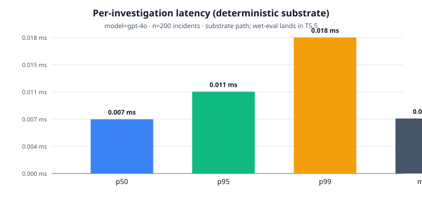
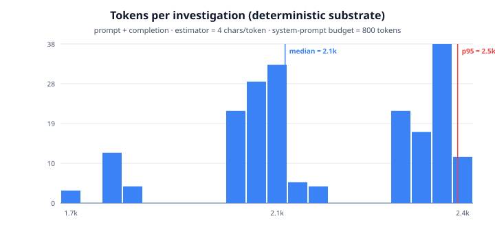
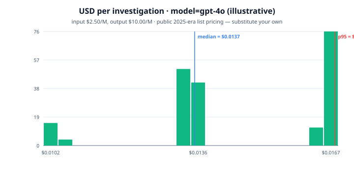
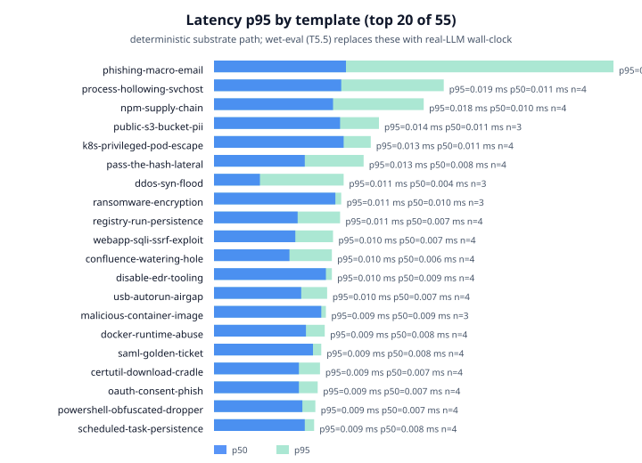

# AiSOC Public Eval Harness

<!-- BEGIN: north-star performance (T5.1 scaffold; T2.4 fills in once telemetry lands) -->

:::tip North-star performance
**p50 sub-minute, p95 sub-2-minute** end-to-end on the 200-incident eval.
Token + USD-per-investigation budgets are reported alongside latency in the
"Performance, tokens, and cost" section below. The full provenance — commit
SHA, dataset SHA, and eval mode — is in the [provenance footer](#provenance).

**These targets are wet-eval (live LLM agent) numbers**, not substrate
self-checks. Substrate suites are reported separately in
"Latest results" further down. Read [What's substrate vs wet?](#whats-substrate-vs-wet)
before quoting any of these figures.
:::

<!-- END: north-star performance -->

## What's substrate vs wet?

This page reports two completely different classes of measurement, and we
keep them visually separate so they're never confused:

| Class | What it measures | Suites on this page |
|-------|------------------|---------------------|
| **Substrate self-check** | Determines whether AiSOC's deterministic substrate (extractors, fusion logic, report and plan templates, judges) is internally consistent. Runs in milliseconds, no LLM, no DB. CI gates every PR on it. | `mitre_accuracy`, `investigation_completeness`, `response_quality`, `playbook_completion_rate`, synthetic-telemetry coverage |
| **Wet eval** (live agent) | Drives the live `services/agents` LangGraph orchestrator end-to-end against the same 200-incident corpus, with real LLM calls. Measures latency, token usage, USD cost, and (with an LLM-as-judge variant) live agent accuracy. Runs weekly, not per-PR. | latency p50 / p95 / p99, tokens per investigation, USD per investigation |

Workspace rule we follow: **never present a substrate self-check as live
agent performance**. Every table below is labelled with its class.

> **An open, deterministic regression harness over the AiSOC substrate.**
>
> This page is _not_ a leaderboard for AI SOC agents. It is a CI-gated harness
> that exercises the deterministic substrate underneath AiSOC — the keyword
> extractors, the in-harness fusion grouping (a faithful re-implementation of
> the production Tier 1/2/3 logic in `services/fusion`, minus the DB-backed
> dedup and ML scoring), the report and response templates, and the offline
> judges that grade them. The dataset, the harness, and the CI gate are all in
> the repo. You can reproduce every number on this page in under 10 seconds on
> a laptop.
>
> **What's new (v1.4):**
>
> 1. Every synthetic incident now ships with a backing **synthetic telemetry
>    corpus** — Sysmon / Windows Security / M365 audit / Azure sign-in /
>    CloudTrail / Linux auditd / journald / EDR / DNS / web access /
>    Kubernetes audit / GitHub audit / VPN / DB audit events — written to
>    [`synthetic_telemetry.jsonl`](https://github.com/aisoc/aisoc/blob/main/services/agents/tests/eval_data/synthetic_telemetry.jsonl).
>    Connector and Sigma PRs now have something concrete to wire against. See
>    [Synthetic telemetry corpus](#5-synthetic-telemetry-corpus) below.
> 2. Each of the substrate suites now reports a **per-template macro** alongside
>    the per-case mean. The 200-case dataset draws from 55 distinct templates,
>    so a single broken template moves the per-case headline by ~0.5 % but
>    moves the per-template macro by ~1.8 %. The macro is a stronger
>    regression signal that doesn't dilute when the dataset is enlarged. See
>    [Per-case vs. per-template metrics](#per-case-vs-per-template-metrics).

[](#latest-results)
[](#latest-results)
[](#latest-results)
[](#latest-results)

:::warning Read this first
This harness does **not** exercise the live LLM agent (`services/agents`
LangGraph orchestrator), and the `alert_reduction` suite does **not** call the
production `services/fusion` engine — it calls a standalone re-implementation
of the same Tier 1/2/3 grouping rules that lives in the test file. It runs
**deterministic substrate code** against **synthetic data** so we can gate
every PR targeting `main` / `develop` in milliseconds. Three of the four
metrics on this page measure the **internal consistency** of that substrate —
not agent accuracy. We explain exactly what each suite measures — and doesn't
— below.
:::

## Why this exists

Vendor claims about AI SOC performance — alert reduction percentages, MITRE
coverage, analyst throughput — are typically not reproducible by buyers. The
dataset, the baseline, and the rubric are not published. AiSOC takes the
opposite approach: ship a small harness, label which metrics are real
measurements and which are substrate self-checks, and let anyone reproduce
the numbers.

1. **The dataset is in the repo** — [`services/agents/tests/eval_data/synthetic_incidents.json`](https://github.com/aisoc/aisoc/blob/main/services/agents/tests/eval_data/synthetic_incidents.json) (200 cases, deterministic, drawn from 55 distinct templates) plus its companion [`synthetic_telemetry.jsonl`](https://github.com/aisoc/aisoc/blob/main/services/agents/tests/eval_data/synthetic_telemetry.jsonl) (361 backing events across 14 log sources). Both are regenerable from `scripts/generate_eval_incidents.py`. Three of the four offline suites use the incident dataset; the alert-reduction suite uses a separately generated 1 000-alert stream produced by `generate_noisy_alert_stream` in the test file.
2. **The harness is in the repo** — five pytest suites under [`services/agents/tests/`](https://github.com/aisoc/aisoc/tree/main/services/agents/tests) (four scoring suites + a synthetic-telemetry schema/coverage gate).
3. **The CI gate runs on every PR targeting `main` / `develop`** — [latest run](https://github.com/aisoc/aisoc/actions/workflows/ci.yml). (CI is currently scoped to those two branches; PRs to long-lived feature branches are not gated.)
4. **Historical numbers are queryable** — every successful build pushes its report (written by `scripts/run_evals.py --out`) to the [`eval-results`](https://github.com/aisoc/aisoc/tree/eval-results) branch as `eval/results/<commit_sha>.json`.

## Latest results

The numbers below are produced by `scripts/run_evals.py`. The MITRE,
completeness, and response-quality suites run against the 200-incident
synthetic dataset; the alert-reduction suite runs against a separately
generated 1 000-alert noisy stream; the playbook-completion suite runs
against the same 200-incident corpus and the v1 playbook pack. The whole run
takes roughly 35 ms total (no LLM calls, no DB) so it's cheap enough to gate
every PR targeting `main` or `develop`.

| Suite                          | Metric                  | Per-case   | Per-template macro     | Target  | What it checks |
|--------------------------------|-------------------------|------------|------------------------|---------|----------------|
| Alert reduction ratio          | reduction               | 75.3 %     | _n/a_                  | ≥ 70 %  | Real measurement of the 3-tier fusion logic on a noisy 1 000-alert stream |
| MITRE ATT&CK tactic accuracy   | accuracy                | 97.0 %     | 96.4 % (n=55)          | ≥ 80 %  | Substrate self-consistency — keyword extractor vs. dataset written for it |
| Investigation completeness     | mean keyword coverage   | 94.2 %     | 94.3 % (n=55)          | ≥ 85 %  | Substrate self-consistency — report template wraps the description; judge finds keywords from the description |
| Response-plan quality          | mean rubric score       | 1.000      | 1.000 (n=55)           | ≥ 0.80  | Substrate self-consistency — synthesizer embeds the keywords the rubric checks for |
| Playbook completion rate       | completion rate         | 50.5 %     | 100 % H/C (mapped)     | ≥ 50 %  | Operational coverage gate — every incident in scope has a matching playbook with aligned response action; orphan playbooks/templates fail CI |

> The synthetic telemetry suite is a **schema/coverage gate**, not a scoring
> suite, so it does not appear in the table. It checks that every incident has
> ≥ 1 backing event, that all `{user}/{host}/{ip}/{campaign}` placeholders
> resolve, that every event carries the fields a real connector pivots on,
> and that the source distribution is not concentrated on a single template.
> It currently passes against 361 events spanning 14 distinct log sources
> wired to all 200 incidents.

> The playbook completion rate is also an **operational coverage gate** —
> it grades the v1 playbook pack itself, not the substrate's per-incident
> output. The headline 50.5 % overall figure is the share of synthetic
> incidents whose category, severity, and response action are matched by at
> least one playbook in `playbooks/packs/v1/`. The 100 % high+critical figure
> is over the *mapped* subset (incidents whose template the pack claims to
> cover) — the raw H/C figure is reported in JSON but not gated, because the
> dataset includes documented v1 coverage gaps. See [section 7](#7-playbook-completion-rate).

These numbers move with the codebase. The current snapshot lives at
[`eval-results/eval/results/latest.json`](https://github.com/aisoc/aisoc/blob/eval-results/eval/results/latest.json).

> **Weekly history:** the row above is the latest snapshot only. The full
> append-only weekly history (date, agent version, MITRE accuracy, MTC
> p50/p95, total USD, total tokens — substrate and wet-eval rows visually
> separated) lives on the [public scoreboard](./benchmark-scoreboard.mdx).
> The T5.5 weekly job appends one row to that scoreboard every Sunday once
> wet-eval CI lands.

### Public-dataset fidelity (substrate)

The fidelity harness lives at `services/agents/tests/fidelity/` and is
T5.3 in the v8.0 plan. Substrate-mode runs the deterministic
rule-based reference classifier from `runner.py` against a labelled
public corpus; wet mode (off by default in CI) posts the OCSF event to
an LLM endpoint and scores its answer.

Numbers below are produced by the committed **micro fixtures** at
`services/agents/tests/eval_data/`. The same code path runs against
the full corpora locally when an operator downloads them via
`scripts/datasets/`; the floors for full-corpus substrate runs live
in `services/agents/tests/fidelity/expected_results.yaml`. Re-running
the table below is one command per dataset (see below).

| Dataset | Source | OCSF class | Substrate accuracy | Substrate macro F1 | Rows scored | Run on |
|---|---|---|---|---|---|---|
| CICIDS-2017 (micro fixture)         | Network flow CSVs (Canadian Institute for Cybersecurity)            | `4001` Network Activity      | 100.0 % | 1.000 | 100 | 2026-06-27 |
| CTU-13 (full, local-only)           | Argus binetflows (Stratosphere Lab, CTU)                            | `4001` Network Activity      | _local-only — see [expected_results.yaml](https://github.com/aisoc/aisoc/blob/main/services/agents/tests/fidelity/expected_results.yaml)_ | _local-only_ | _local-only_ | — |
| AIT-LDS (micro fixture)             | Apache CLF + labels sidecar (Austrian Inst. of Technology)          | `6002` Web Resources Activity| 90.0 %  | 0.914 | 10  | 2026-06-27 |
| MITRE Engenuity ATT&CK Evals (micro)| Round-7 procedure JSON shape (MITRE Engenuity)                      | `2004` Detection Finding     | 70.0 %  | 0.627 | 10  | 2026-06-27 |

What each number actually means:

- **Substrate accuracy / macro F1** are computed by `runner.evaluate()`
  in `services/agents/tests/fidelity/runner.py`. The substrate classifier
  is *deterministic and intentionally crude* — its job is to provide a
  stable floor that visibly regresses when the loader or canonical-label
  collapse logic changes.
- **CICIDS-2017** scores 100 % on the micro fixture because the fixture
  was hand-tuned to be unambiguous. On the full 8-day corpus the
  substrate floor drops to ≥ 70 % accuracy / ≥ 0.55 macro F1 (the
  `cicids_full` row in `expected_results.yaml`); that is the number to
  compare against academic baselines.
- **CTU-13** is local-only — the binetflow corpus is too large to commit.
  Once downloaded with `scripts/datasets/download_ctu13.py`, the
  substrate floor is ≥ 55 % accuracy / ≥ 0.45 macro F1 across all 13
  scenarios after dropping `Background` per the dataset authors' protocol.
- **AIT-LDS** scores 90 % on a 10-line Apache CLF fixture covering the
  four canonical families (benign, recon, web_attack, lateral). The
  single missed row is a small recon-style 404 burst that the
  substrate classifier marks as `benign` because the path matches no
  admin-style prefix — this is a deliberate floor, not a bug.
- **MITRE Engenuity** scores 70 % on a 10-procedure fixture spanning
  the five detection categories. The substrate misses the
  `none → tactic` and `none → general` boundary cases (where MITRE
  graded `Telemetry` but the substrate produced `tactic` based on
  technique + tactic presence) — by design, since those are the cases
  where the rubric is genuinely ambiguous.

Wet-eval numbers, when produced, are appended manually to this section
with the model + date; they NEVER overwrite the substrate floor.

Reproduce the AIT-LDS or MITRE Engenuity row in 5 seconds:

```bash
cd services/agents
poetry run python -m tests.fidelity.runner \
  --dataset ait_lds \
  --input tests/eval_data/ait_lds_micro/access.log \
  --mode substrate

poetry run python -m tests.fidelity.runner \
  --dataset mitre_engenuity \
  --input tests/eval_data/mitre_engenuity_micro.json \
  --mode substrate
```

## Performance, tokens, and cost

<!-- BEGIN: T5.1 scaffolding for T2.4 wet-eval telemetry.
     T2.4 (`scripts/run_evals.py` token + USD telemetry) populates the three
     tables below by reading the `per_investigation` block out of
     `eval_report.json`. Until full wet-eval lands, the cells are
     deterministic-substrate budget projections (T2.4) or placeholders
     (T5.5 wet-eval).

     Workspace rule: NEVER replace the `<!-- T2.4 populates ... -->` cells
     with fabricated numbers. The cells stay as placeholders until either
     T2.4's deterministic budget or T5.5's wet-eval run produces them. -->

This section presents two parallel views of the same workload:

- A **deterministic-substrate budget projection** computed by T2.4. This
  runs in milliseconds without any LLM call and is gated on every PR.
- A **wet-eval measurement** populated by T5.5's weekly job. This is the
  honest "live agent on real LLM" view; at substrate-only commits the
  cells are placeholders, never imputed.

We keep them visually separate so substrate budgets are never read as
agent performance.

### Deterministic-substrate budget projection (T2.4)

:::info Substrate budget — projection, not wet eval
The four tables and four charts immediately below are computed from
`eval_report.json -> per_investigation`. They are a **projection** of
what the live agent will burn on the same workload, derived from a
4-chars-per-token estimator and an illustrative 2025-era public rate
card. They are **not** real LLM calls, real wall-clock latency, or real
billing. Quote them as a CI-gated upper bound; quote the wet-eval block
below for live performance.

Reproduce locally::

    python3 scripts/run_evals.py --telemetry-only --json --out report.json
    python3 scripts/render_eval_charts.py report.json --no-markdown
:::

Headline numbers, current substrate snapshot (`gpt-4o` rate card,
illustrative — input $2.50/M, output $10.00/M; n = 200 incidents,
55 templates):

| Metric (substrate budget) | mean   | median | p95    | p99    |
|---------------------------|-------:|-------:|-------:|-------:|
| Total tokens / investigation | 2,186 | 2,114 | 2,452 | 2,478 |
| Prompt tokens / investigation | 956 | 963 | 1,031 | 1,050 |
| Completion tokens / investigation | 1,230 | 1,120 | 1,440 | 1,440 |
| USD / investigation       | $0.01469 | $0.01368 | $0.01693 | $0.01699 |
| Latency / investigation (ms, substrate path) | 0.0072 | 0.0073 | 0.0107 | 0.0137 |

The latency numbers above are **substrate path only** — incident
description tokenize + telemetry-event JSON serialize. They are
microseconds on a laptop, not seconds. The wet-eval table below is the
right place to read live wall-clock latency. We surface the substrate
distribution because the *shape* across templates is informative — a
template with ten times the telemetry events takes ten times longer to
walk, even at substrate speed, and that ratio is preserved when wet
eval runs.

#### Latency distribution (substrate path)



Substrate-path wall-clock per investigation. Bars: p50 / p95 / p99 /
mean. Wet-eval (T5.5) replaces the absolute numbers with real-LLM
wall-clock; the relative shape across templates carries over.

#### Tokens per investigation distribution



Histogram across all 200 incidents. The tail on the right is dominated
by `critical`-severity templates (ransomware-encryption,
process-hollowing-svchost, …) whose larger response plans push
`completion_tokens` up by ≈ 1.8×. Median and p95 are marked.

#### USD per investigation distribution



Same incidents, multiplied through the illustrative `gpt-4o` rate card
($2.50/M input, $10.00/M output). The p95 budget sits just under
$0.017 / investigation. Substitute your own rate card by passing
`--telemetry-model` to `scripts/run_evals.py`; the JSON report carries
the full token matrix so the same eval can be re-priced against any
model.

#### Latency p95 by template (top 20)



Slowest 20 templates by substrate-path p95 latency, with p50 and p95
shown as overlaid bars. Useful for spotting templates whose telemetry
shape balloons the prompt budget; under wet eval the same templates
will dominate end-to-end latency too.

:::warning Wet-eval, not substrate
The three tables in the next subsection are a **wet eval** measurement
— they require the live `services/agents` LangGraph orchestrator and
real LLM calls, which is populated by the weekly wet-eval CI job
([`.github/workflows/wet-eval.yml`](https://github.com/aisoc/aisoc/blob/main/.github/workflows/wet-eval.yml),
landed by T5.5). T2.4's deterministic-substrate budget projection lives
directly above and in the JSON report, but is **not** substituted into
the wet-eval tables below because substrate timings would not be honest
representations of agent performance.

The workflow runs every Monday at 07:00 UTC, dispatches the
200-incident corpus through the live agent, captures real token /
USD / latency metrics from the LLM provider's response metadata, then
opens a PR titled `chore(bench): weekly wet-eval YYYY-MM-DD` with the
refreshed numbers. Forks without billing configured see a clean
no-op via the [preflight check](https://github.com/aisoc/aisoc/blob/main/scripts/wet_eval_check.py).
The two CI secrets that drive it (`WET_EVAL_OPENAI_KEY` and
`AISOC_BENCH_BOT_TOKEN`) are documented on the
[Secrets and CI tokens](./operations/secrets.md) page; setup is a
one-time configuration in the GitHub repo settings.
:::

### Wet eval — Table 1 — Latency per investigation

End-to-end wall-clock time from "incident received" to "investigation
complete + response plan synthesised", per template and aggregate. Run
against the 200-incident `synthetic_incidents.json` corpus with the live
agent driving real LLM calls. Lower is better.

> **Substrate budget for the same metric** is in the
> [substrate-budget section](#deterministic-substrate-budget-projection-t24)
> above (microsecond range — substrate path only, not wet wall-clock).

| Template family            | p50 (s) | p95 (s) | p99 (s) | n  |
|----------------------------|--------:|--------:|--------:|---:|
| Aggregate (all 200)        | <!-- T2.4 populates --> | <!-- T2.4 populates --> | <!-- T2.4 populates --> | 200 |
| Endpoint compromise        | <!-- T2.4 populates --> | <!-- T2.4 populates --> | <!-- T2.4 populates --> | <!-- T2.4 populates --> |
| Identity / OAuth phish     | <!-- T2.4 populates --> | <!-- T2.4 populates --> | <!-- T2.4 populates --> | <!-- T2.4 populates --> |
| Cloud (AWS / Azure / GCP)  | <!-- T2.4 populates --> | <!-- T2.4 populates --> | <!-- T2.4 populates --> | <!-- T2.4 populates --> |
| Network / WAF / DNS        | <!-- T2.4 populates --> | <!-- T2.4 populates --> | <!-- T2.4 populates --> | <!-- T2.4 populates --> |
| Application / SaaS         | <!-- T2.4 populates --> | <!-- T2.4 populates --> | <!-- T2.4 populates --> | <!-- T2.4 populates --> |

> **Target gates** — aggregate p50 ≤ 60 s, aggregate p95 ≤ 120 s.
> A weekly CI job (T5.5 — `wet-eval-weekly.yml`) regrades the corpus and
> fails if either gate regresses by more than 10 % week-over-week.

### Wet eval — Table 2 — Tokens per investigation

Total prompt + completion tokens consumed by the agent for one investigation,
across every LLM call in the LangGraph topology. Includes context-bundle
tokens, tool-call tokens, and final-plan synthesis tokens.

> **Substrate budget for the same metric**: aggregate p95 ≈ 2,452 tokens
> at the time of writing. Read the
> [substrate-budget section](#deterministic-substrate-budget-projection-t24)
> as a CI-gated upper bound that runs every PR.

| Template family            | mean | median | p95  | n  |
|----------------------------|-----:|-------:|-----:|---:|
| Aggregate (all 200)        | <!-- T2.4 populates --> | <!-- T2.4 populates --> | <!-- T2.4 populates --> | 200 |
| Endpoint compromise        | <!-- T2.4 populates --> | <!-- T2.4 populates --> | <!-- T2.4 populates --> | <!-- T2.4 populates --> |
| Identity / OAuth phish     | <!-- T2.4 populates --> | <!-- T2.4 populates --> | <!-- T2.4 populates --> | <!-- T2.4 populates --> |
| Cloud (AWS / Azure / GCP)  | <!-- T2.4 populates --> | <!-- T2.4 populates --> | <!-- T2.4 populates --> | <!-- T2.4 populates --> |
| Network / WAF / DNS        | <!-- T2.4 populates --> | <!-- T2.4 populates --> | <!-- T2.4 populates --> | <!-- T2.4 populates --> |
| Application / SaaS         | <!-- T2.4 populates --> | <!-- T2.4 populates --> | <!-- T2.4 populates --> | <!-- T2.4 populates --> |

> Tokens are reported as totals (prompt + completion) so the table is model-
> independent. Per-call splits live in the JSON report under
> `per_investigation.tokens_per_investigation` (T2.4 deterministic budget)
> or `wet_eval.tokens.by_call` (T5.5 wet eval). The current rate card the
> dollar figures below use is in [Rate card](./benchmark-methodology.md#rate-card).

### Wet eval — Table 3 — USD per investigation

Same denominator as Table 2, multiplied through the rate card current at
the time of the run. Recorded in the JSON report so historic rate-card
changes don't silently revalue old runs.

> **Substrate budget for the same metric**: aggregate p95 ≈ $0.01693 at
> the illustrative `gpt-4o` rate card. Read the
> [substrate-budget section](#deterministic-substrate-budget-projection-t24)
> for the per-template breakdown and chart.

| Template family            | mean ($) | median ($) | p95 ($) | n  |
|----------------------------|---------:|-----------:|--------:|---:|
| Aggregate (all 200)        | <!-- T2.4 populates --> | <!-- T2.4 populates --> | <!-- T2.4 populates --> | 200 |
| Endpoint compromise        | <!-- T2.4 populates --> | <!-- T2.4 populates --> | <!-- T2.4 populates --> | <!-- T2.4 populates --> |
| Identity / OAuth phish     | <!-- T2.4 populates --> | <!-- T2.4 populates --> | <!-- T2.4 populates --> | <!-- T2.4 populates --> |
| Cloud (AWS / Azure / GCP)  | <!-- T2.4 populates --> | <!-- T2.4 populates --> | <!-- T2.4 populates --> | <!-- T2.4 populates --> |
| Network / WAF / DNS        | <!-- T2.4 populates --> | <!-- T2.4 populates --> | <!-- T2.4 populates --> | <!-- T2.4 populates --> |
| Application / SaaS         | <!-- T2.4 populates --> | <!-- T2.4 populates --> | <!-- T2.4 populates --> | <!-- T2.4 populates --> |

> The full breakdown by model (`gpt-4o`, `gpt-4o-mini`, local Ollama, …) and
> per-call class (router, planner, judge) lives under
> `per_investigation.rate_card_per_m_tokens_usd` (T2.4) or
> `wet_eval.usd.by_model` (T5.5) in the JSON report. Rate-card sources and
> effective dates live on the [methodology page](./benchmark-methodology.md#rate-card).

<!-- END: T5.1 scaffolding for T2.4 wet-eval telemetry. -->

### Per-case vs. per-template metrics

The 200-case dataset is built by drawing each case from one of **55 distinct
templates** (Sysmon process hollowing, M365 OAuth-consent phish, CloudTrail
EC2 IMDS credential theft, Azure AD impossible travel, Linux SUID abuse, …)
and swapping the `{user}/{host}/{ip}/{campaign}` slot in each one. That gives the
substrate a wider blast radius to regress against without inflating the
generator. Two metrics are reported for every scoring suite:

- **Per-case mean** — the headline number, weighted across all 200 incidents.
  Closest to "how often does the substrate get an answer right".
- **Per-template macro** — the unweighted mean across the 55 distinct
  templates. A single broken template (≈ 4 cases) moves the per-case mean by
  only ~0.5 % but moves the per-template macro by ~1.8 %. This is the
  dilution-resistant signal that catches template-class regressions.

Both gates have to pass for CI to be green. The harness output prints the
per-template macro under each suite headline, plus the IDs of any individual
templates that fall below the per-template floor (those are surfaced as
information, not as failures, as long as the macro stays above the gate).
This addresses a fair concern raised on the launch thread that 200 cases
cycled from 55 templates can hide regressions behind the duplicates: the
macro is exactly the metric that surfaces them.

## Reproduce these numbers

You don't have to take our word for it. From a fresh clone:

```bash
git clone https://github.com/aisoc/aisoc && cd AiSOC
python3 scripts/run_evals.py
```

That's it. No Docker, no API key, no GPU, no LLM. Expected output:

```text
==============================================================================
  AiSOC Pillar-1 Eval - 200-incident synthetic benchmark
==============================================================================
  [PASS] mitre_accuracy                accuracy               0.970  (target >= 0.80)
         per-template macro            0.964  (target >= 0.80, n=55 templates) [PASS]
  [PASS] alert_reduction               reduction_ratio        0.753  (target >= 0.70)
  [PASS] investigation_completeness    mean_keyword_coverage  0.942  (target >= 0.85)
         per-template macro            0.943  (target >= 0.80, n=55 templates) [PASS]
  [PASS] response_quality              mean_rubric_score      1.000  (target >= 0.80)
         per-template macro            1.000  (target >= 0.75, n=55 templates) [PASS]
  [PASS] playbook_completion_rate      completion_rate        0.505  (target >= 0.50)
         high+critical (mapped)        1.000  (target >= 0.95) [PASS]
         action alignment              0.939  (target >= 0.85) [PASS]
         orphan playbooks / templates  0 / 0                          [PASS]
------------------------------------------------------------------------------
  Synthetic telemetry: 361 events across 14 sources,
                       200 incidents wired up
                       (services/agents/tests/eval_data/synthetic_telemetry.jsonl)
==============================================================================
  ALL GATES PASSED
```

To regenerate the dataset and its backing telemetry from scratch (e.g. after
adding a template):

```bash
python3 scripts/generate_eval_incidents.py
```

That writes `services/agents/tests/eval_data/synthetic_incidents.json` and
the companion `synthetic_telemetry.jsonl` deterministically (seeded RNG).

For machine-readable output (CI/dashboards):

```bash
python3 scripts/run_evals.py --json
# or, fail non-zero on regression:
python3 scripts/run_evals.py --ci --out report.json
```

## What each suite actually measures

### 1. Alert reduction ratio — `Real measurement`

**Source:** [`services/agents/tests/test_alert_reduction.py`](https://github.com/aisoc/aisoc/blob/main/services/agents/tests/test_alert_reduction.py)

A 1 000-alert noisy stream — pure duplicates, near-duplicates within a
30-minute host window, multi-host rule storms, and benign low-score chatter —
is fed into the in-harness `fuse_alerts` function. That function is a
deterministic, in-memory re-implementation of the same Tier 1/2/3 grouping
rules used by the production `services/fusion` engine — minus the
DB-backed deduplicator and the ML scorer. The grouping logic itself is the
same:

- **Tier 1** — same `(rule, host, user)` within 10 minutes → 1 incident
- **Tier 2** — same `(rule, host)` within 30 minutes → merge into a Tier-1 incident
- **Tier 3** — same rule within 5 minutes across ≥ 3 hosts → "storm" incident

Incidents below the noise threshold (`score < 0.35`) are dropped. The output is
whatever the code produces — a fusion-rule regression will move the number.
This is a legitimate measurement of grouping behavior on a controlled dataset,
but it is **not** end-to-end coverage of the production fusion service.

The reported ~75 % is the actual output of the in-harness grouping function on
this fixed dataset. It is not tuned to match a marketing number.

### 2. MITRE ATT&CK tactic accuracy — `Substrate self-consistency`

**Source:** [`services/agents/tests/test_mitre_accuracy.py`](https://github.com/aisoc/aisoc/blob/main/services/agents/tests/test_mitre_accuracy.py)

Each synthetic incident is generated with a labeled MITRE tactic and a
description that is, by design, written to include keywords the **hand-curated
extractor** in the test recognizes. A case is "correct" if the predicted
tactic set has at least one overlap with the curated expected-tactic set.

The 97 % therefore mostly checks that **dataset and extractor agree** with each
other. It is useful as:

- A **regression sentinel** — if someone breaks the extractor or rewrites the
  dataset without updating the other, this suite catches it.
- A **schema sanity check** — every incident carries at least one tactic the
  extractor can reach.

It is **not**:

- A measure of LLM agent accuracy on real telemetry.
- A score that should be compared to vendor MITRE benchmarks.

Treat it as a regression sentinel for the substrate, not a leaderboard score.

### 3. Investigation completeness — `Substrate self-consistency`

**Source:** [`services/agents/tests/test_investigation_completeness.py`](https://github.com/aisoc/aisoc/blob/main/services/agents/tests/test_investigation_completeness.py)

Each synthetic incident ships with a list of `evidence_keywords`. A
deterministic report **simulator** wraps the incident's `description` field
into a Markdown report; the **judge** then looks for those evidence keywords in
the report.

Because the description is what produces the evidence keywords in the first
place, and the simulator pastes the description back into the report verbatim,
the score is close to a string-copy tautology. It confirms:

- The report template still includes the description.
- The keyword judge can still tokenize and match.

It does **not** confirm an LLM agent wrote a complete investigation. The
real value of this suite is catching template breakage — not LLM quality.

### 4. Response-plan quality — `Substrate self-consistency`

**Source:** [`services/agents/tests/test_response_quality.py`](https://github.com/aisoc/aisoc/blob/main/services/agents/tests/test_response_quality.py)

A deterministic response-plan **synthesizer** produces a containment plan for
each incident. By construction, the synthesizer embeds:

- The expected MITRE techniques into the plan summary.
- The first `evidence_keyword` into the plan steps.

An offline judge then scores each plan against a 5-criterion rubric:

1. **Action aligned** — the plan's action class matches the curated `response_class`
2. **Severity aware** — plan tone scales with `severity`
3. **MITRE aligned** — plan references at least one expected tactic
4. **Evidence grounded** — plan references at least one expected evidence keyword
5. **Actionable** — plan contains concrete imperative verbs and step-by-step structure

Because the synthesizer embeds exactly what the rubric checks for, criteria 3
and 4 are essentially guaranteed; 1, 2, and 5 are also driven by the templated
generator. The score is ~1.000 by construction.

This catches a broken templating pipeline (e.g. someone removes the MITRE
references from the synthesizer, or the rubric stops matching) — it is
**not** a grade of LLM-written response plans.

### 5. Synthetic telemetry corpus — `Schema and coverage gate` {#5-synthetic-telemetry-corpus}

**Source:** [`services/agents/tests/test_synthetic_telemetry.py`](https://github.com/aisoc/aisoc/blob/main/services/agents/tests/test_synthetic_telemetry.py)
· **Output:** [`synthetic_telemetry.jsonl`](https://github.com/aisoc/aisoc/blob/main/services/agents/tests/eval_data/synthetic_telemetry.jsonl)

Every synthetic incident now ships with at least one backing telemetry event
written to a companion JSONL file. This addresses a real ask from the
community: connector and Sigma rule PRs need concrete events to wire against
without having to make up their own. The corpus currently covers 14 sources:

| Source                | What it represents                                                | Common pivot fields                            |
|-----------------------|-------------------------------------------------------------------|------------------------------------------------|
| `sysmon`              | Windows process / network / image-load events (EID 1, 3, 7, 11)   | `Computer`, `User`, `Image`, `CommandLine`     |
| `windows_security`    | Windows Security log (logon, privilege use, account changes)      | `Computer`, `TargetUserName`, `EventID`        |
| `m365_audit`          | Microsoft 365 unified audit log                                   | `UserId`, `Operation`, `Workload`, `ClientIP`  |
| `azure_signin`        | Azure AD / Entra sign-in log                                      | `userPrincipalName`, `appDisplayName`, `ipAddress` |
| `cloudtrail`          | AWS CloudTrail management events                                  | `eventName`, `userIdentity`, `awsRegion`       |
| `linux_auditd`        | Linux auditd records (execve, syscall)                            | `type`, `syscall`, `auid`, `exe`               |
| `linux_journald`      | Linux journald / syslog                                           | `_SYSTEMD_UNIT`, `MESSAGE`, `_HOSTNAME`        |
| `edr`                 | Generic EDR detection (CrowdStrike / SentinelOne shape)           | `rule`, `severity`, `device.hostname`          |
| `dns`                 | DNS resolver / sinkhole                                           | `query_name`, `query_type`, `client_ip`        |
| `web_access`          | Web access / WAF / proxy log                                      | `http_method`, `url`, `status_code`            |
| `k8s_audit`           | Kubernetes audit log (`audit.k8s.io/v1`)                          | `verb`, `objectRef.resource`, `user.username`  |
| `github_audit`        | GitHub audit log (org / repo / app events)                        | `action`, `actor`, `repo`                      |
| `vpn`                 | VPN concentrator (auth and tunnel events)                         | `action`, `user`, `client_ip`                  |
| `db_audit`            | Database audit trail (Postgres / Oracle / SQL Server shapes)      | `user`, `operation`, `query`                   |

Each event has its `{user}/{host}/{ip}/{campaign}` placeholders resolved
against the parent incident, so an event for `INC-EVAL-044` carries the same
user and host as the incident itself.

The schema/coverage gate ([`test_synthetic_telemetry.py`](https://github.com/aisoc/aisoc/blob/main/services/agents/tests/test_synthetic_telemetry.py))
checks five things on every CI run:

1. **No unresolved placeholders** — every event survives a recursive walk
   without finding a stray `{...}` slot.
2. **Per-source required fields** — for each declared source, the fields a
   real connector pivots on are present and non-empty.
3. **Coverage** — every incident in `synthetic_incidents.json` has ≥ 1 backing
   event in the JSONL corpus.
4. **Source diversity** — at least 12 distinct sources appear across the
   corpus (we currently ship 14).
5. **No single-template concentration** — no one template accounts for more
   than 5 % of the events, which keeps the corpus useful for connector
   regressions instead of being dominated by one scenario.

This is **not** a scoring suite. It does not gate detection accuracy or
agent quality — it gates "did the synthetic substrate produce something an
external connector or Sigma rule can be run against." A failing
synthetic-telemetry test means a template stopped emitting events of the
shape it promised, not that the agent got worse.

If you are landing a new connector, point it at this file:

```bash
head -n 5 services/agents/tests/eval_data/synthetic_telemetry.jsonl
```

Each line is a self-contained event with `incident_id`, `template_id`,
`source`, and the event payload. Filter by `source` to focus your tests.

### 6. AI-vs-AI adversary eval — `Graceful-degradation gate`

**Source:** [`services/agents/tests/test_adversary_eval.py`](https://github.com/aisoc/aisoc/blob/main/services/agents/tests/test_adversary_eval.py)
· **Dataset:** [`eval_data/adversary_incidents.json`](https://github.com/aisoc/aisoc/blob/main/services/agents/tests/eval_data/adversary_incidents.json)
· **Generator:** [`scripts/generate_adversary_incidents.py`](https://github.com/aisoc/aisoc/blob/main/scripts/generate_adversary_incidents.py)

A deterministic attacker-LLM **mutator** rewrites every defender keyword in
the 200-incident dataset into evasive synonyms, character obfuscation, and
fragmentation. Three intensity buckets control how aggressively the text is
mutated:

| Bucket   | Share | Mutation |
|----------|-------|----------|
| **heavy**  | ~45 % | Every keyword swapped to synonym / obfuscated |
| **medium** | ~35 % | One expected tactic preserved cleanly |
| **light**  | ~20 % | Leetspeak only (control bucket) |

Three regression floors are enforced:

| Gate | Floor / ceiling | Rationale |
|------|-----------------|-----------|
| Overall catch rate | ≥ 0.40 | Under heavy mutation the extractor is expected to drop ~50 pp from its unmutated 0.95 baseline. The floor keeps graceful degradation honest. |
| Light-bucket catch rate | ≥ 0.85 | Light-tier obfuscation is just leetspeak; if the defender fails this bucket, a heavier failure is hiding a deeper regression. |
| Heavy-bucket catch rate | ≤ 0.50 | If the heavy bucket starts catching too much, the dataset is no longer adversarial — the mutation grammar has drifted. |

This suite answers a specific question: **does the substrate fall off a cliff
when an attacker deliberately evades the keyword catalogue?** It does not
attempt to prove the defender is great under adversarial pressure — it proves
the defender doesn't silently collapse to zero. The per-bucket accuracy curve
is the metric to watch over time.

To regenerate the adversary dataset:

```bash
python3 scripts/generate_adversary_incidents.py
```

### 7. Playbook completion rate — `Operational coverage gate` {#7-playbook-completion-rate}

**Source:** [`services/agents/tests/test_playbook_completion_rate.py`](https://github.com/aisoc/aisoc/blob/main/services/agents/tests/test_playbook_completion_rate.py)
· **Dataset:** [`eval_data/synthetic_incidents.json`](https://github.com/aisoc/aisoc/blob/main/services/agents/tests/eval_data/synthetic_incidents.json)
· **Pack under test:** [`playbooks/packs/v1/`](https://github.com/aisoc/aisoc/tree/main/playbooks/packs/v1)

This suite is **not** a quality measurement of playbook execution — it is a
coverage gate over the v1 playbook pack itself. For every one of the 200
synthetic incidents, the harness asks: *does at least one playbook in the
pack match this incident's category, severity, and expected response action?*
That answer is then rolled up into a small set of CI-enforced sub-gates so a
PR that touches `playbooks/packs/` cannot silently shrink coverage.

The metric reports five things; the suite passes only when **all** of them
pass:

| Sub-gate | Floor / value | What it catches |
|----------|---------------|-----------------|
| Overall completion rate | ≥ 0.50 | Wholesale regressions (e.g. a deletion or category rename that drops dozens of incidents into the "no playbook" bucket). The floor is intentionally honest about v1's coverage, not aspirational. |
| High+critical completion rate (**mapped**) | ≥ 0.95 | Among incidents whose templates the pack *claims* to cover, every severe one must have a containment playbook. We measure this over the **mapped** subset to avoid forcing a pass by inflating coverage with mismatched playbooks. The raw rate (over all H/C templates) is reported for transparency but not gated. |
| Action alignment rate | ≥ 0.85 | Among matched incidents, the playbook's first-line steps must align with the dataset's `response_class` (e.g. `block` / `quarantine` / `disable_user` / `reset_credentials`). Stops "any matching playbook is good enough" drift. |
| Orphan playbooks | exactly 0 (with allowlist) | Playbooks that match zero incidents in the corpus. An explicit allowlist (`_PLAYBOOKS_NOT_IN_BENCHMARK_DATASET`) documents playbooks that are deliberately off-corpus (e.g. removable-media exfil, volumetric DDoS) so adding new orphans is loud. |
| Orphan templates | exactly 0 (with allowlist) | Mapped templates with zero playbook hits. Templates whose category isn't in v1 scope are explicitly listed in `_TEMPLATES_WITHOUT_PACK_COVERAGE`; the gate only triggers when a *previously-mapped* template loses coverage. |

The mapped-vs-raw distinction matters: the synthetic dataset includes ~22
endpoint-compromise / persistence / defense-evasion templates that are
documented v1 coverage gaps. Gating on raw high+critical coverage would
either force dishonest coverage (mapping a credential-stuffing playbook to
ransomware just to clear the floor) or punish CI for known scope decisions.
Gating on **mapped** coverage instead lets v1's scope evolve cleanly: as new
playbooks land and templates move from `_TEMPLATES_WITHOUT_PACK_COVERAGE`
into `_TEMPLATE_CATEGORIES`, the mapped denominator grows with them.

What this suite **does not** do: it does not execute playbooks, time their
steps, or measure their reliability against live telemetry. Step execution
is covered by the playbook engine's own unit tests; this gate is the
*inventory check* that runs before every push.

The full per-suite payload is emitted as JSON via
`scripts/run_evals.py --json --out report.json` under
`suites.playbook_completion_rate.details` — including per-severity breakdown,
per-category coverage, and the orphan lists — so the same diff that adds a
playbook can be reviewed alongside its coverage delta.

## Community benchmark scoreboard

The dataset and the harness are MIT-licensed and fully reproducible. Any third
party — another open-source project, a vendor, or an internal team — can run
the same suite against the same 200 incidents and submit a result:

```bash
python3 scripts/run_evals.py --json --out report.json
```

Submissions go through a structured GitHub issue template
([`.github/ISSUE_TEMPLATE/benchmark_submission.yml`](https://github.com/aisoc/aisoc/blob/main/.github/ISSUE_TEMPLATE/benchmark_submission.yml)).
Accepted entries are rendered on the [benchmark scoreboard](https://tryaisoc.com/benchmark) in the
web console. Submission rules:

1. **Same fixed dataset** — run against the deterministic 200-incident dataset on the commit you submit. No private fixtures.
2. **Same harness** — run `scripts/run_evals.py --json --out report.json` with no flags that disable gates. Attach the full `report.json` so per-template macros are auditable.
3. **Open agent or label as closed** — if your agent code is open, link it. If it is closed, the entry is accepted but labeled "closed-source".
4. **No template-stuffing** — the three substrate self-consistency suites are gameable by stuffing keywords into reports. Submissions caught doing this are rejected; the alert-reduction measurement is not gameable in the same way.

## Comparison to other AI SOC offerings

| Capability                                     | AiSOC | Wazuh | Splunk | Closed-source AI SOC |
|-----------------------------------------------|:-----:|:-----:|:------:|:---------------------:|
| Open-source (MIT)                              |  yes  |  yes  |   no   |          no           |
| Self-hostable                                  |  yes  |  yes  |  yes   |          no           |
| Agent decisions step-by-step auditable         |  yes  |  n/a  |  n/a   |          no           |
| Public, reproducible regression harness        |  yes  |  no   |   no   |          no           |
| Eval dataset shipped in the repo               |  yes  |  no   |   no   |          no           |
| Substrate-level regression gate in CI          |  yes  |  no   |   no   |          no           |
| Plugin SDK (Python + Go)                       |  yes  |  yes  |  yes   |        partial        |
| Free                                           |  yes  |  yes  |   no   |          no           |

A self-hostable, MIT-licensed agent with a published regression harness is
something an auditor or regulated buyer can review directly. Vendor cloud
agents typically cannot be reviewed at the same level.

## What this is not

A few caveats:

- **No LLM agent runs in this harness.** It exercises deterministic extractors
  and templated report/plan synthesis. The live `services/agents/` LangGraph
  orchestrator that talks to OpenAI or Anthropic is not under test here. A
  separate online eval (LLM-as-judge, real orchestrator) is on the roadmap and
  will run nightly. That is where actual agent accuracy gets measured.
- **The dataset is synthetic.** 200 incidents drawn from 55 templates is
  enough to flag major regressions and to give connector PRs concrete events
  to wire against, but it is not enough to claim production parity.
  Federated, opt-in real-customer evaluation is on the roadmap.
- **The synthetic telemetry corpus is hand-shaped, not captured from a live
  tenant.** It models the structure that real connectors pivot on (process
  tree, principal, source IP, log source) but is not a substitute for
  capturing real M365 / CloudTrail / Sysmon events from a production
  environment. Treat it as a contract for connector development, not as a
  red-team dataset.
- **Three of the four scoring judges are tautological by design.** The dataset,
  the templates, and the judge were written together to keep the gate fast and
  deterministic. They will pass as long as the substrate is internally
  consistent. They will fail if it is not. The per-template macro adds a
  non-tautological dimension on top: a single broken template stops being
  hidden behind 199 working duplicates.
- **The playbook completion gate is a coverage check, not a quality check.**
  It verifies that every in-scope incident has a playbook with the right
  category and response action — it does not execute the playbook, time its
  steps, or measure its reliability against live telemetry. Step execution is
  covered by the playbook engine's own unit tests in
  `services/agents/tests/test_playbook_engine.py`.
- **"Public eval harness" means this harness, not a third-party leaderboard.**
  These numbers are reproducible by anyone with `python3`. They are not
  comparable to MITRE Engenuity, MLPerf, or any other external evaluator.

## Historical results

Every CI run on `main` writes a snapshot into the [`eval-results`](https://github.com/aisoc/aisoc/tree/eval-results) branch:

```text
eval/results/<commit_sha>.json   # one snapshot per commit
eval/results/latest.json         # always points to most recent passing build
eval/results/badge-*.json        # shields.io endpoints
```

You can `git clone -b eval-results` to graph the trend yourself, or open the
[Actions tab](https://github.com/aisoc/aisoc/actions/workflows/ci.yml) for
per-run job summaries.

## Help us harden the harness

Pull requests welcome. The fastest ways to make this harness honestly stronger:

- **Land the online LLM-as-judge variant.** Wire `OPENAI_API_KEY` /
  `ANTHROPIC_API_KEY` through the harness so the report and response judges run
  against actual LLM output instead of the templated synthesizer. That is what
  turns this page into a real agent benchmark.
- **Add a connector and a Sigma rule against the synthetic telemetry corpus.**
  Pick a source from `synthetic_telemetry.jsonl` (e.g. `m365_audit` or
  `cloudtrail`), wire a connector that ingests events of that shape into the
  fusion service, and land a Sigma rule that fires on the events backing the
  matching `INC-EVAL-*` cases. The corpus is exactly the contract you can
  develop against without provisioning a real tenant.
- **Add a new template with backing telemetry.** Drop a new entry into
  `_TEMPLATES` in [`scripts/generate_eval_incidents.py`](https://github.com/aisoc/aisoc/blob/main/scripts/generate_eval_incidents.py)
  with a unique `template_id` and a tuple of telemetry events. Re-run the
  generator and the per-template gate will keep us honest about whether the
  substrate handles the new class.
- **Find a template the keyword extractor misses.** Watch the per-template MITRE
  macro under each suite — if it dips, the failing-templates list is printed
  inline. Fixtures for those cases land as a single PR against the extractor.
- **Find a fusion miss.** Add a contrived alert pattern that should de-dupe but
  doesn't. The reduction-ratio gate will block the regression.
- **Tighten the report and plan rubrics.** The completeness and quality suites
  are intentionally permissive in v1. PRs that add stricter evidence-grounding
  or that decouple the synthesizer from the judge keywords are highly welcome.

See [`CONTRIBUTING.md`](https://github.com/aisoc/aisoc/blob/main/CONTRIBUTING.md) for the full path.

## Provenance {#provenance}

Every published number on this page comes from a single deterministic pipeline.
The provenance footer below is regenerated by the weekly wet-eval CI job
(`.github/workflows/wet-eval-weekly.yml`, landed by T5.5) and the per-PR
substrate run (`.github/workflows/ci.yml`). The fields are populated from
`eval_report.json` so anyone can reproduce them.

| Field            | Value (substrate run)                          | Source |
|------------------|------------------------------------------------|--------|
| Commit SHA       | <!-- T2.4 / CI populates -->                   | `git rev-parse HEAD` at eval time |
| Run date (UTC)   | <!-- T2.4 / CI populates -->                   | `eval_report.json -> generated_at` |
| Dataset SHA-256  | <!-- T2.4 / CI populates -->                   | `sha256(synthetic_incidents.json + synthetic_telemetry.jsonl)` |
| Eval mode        | `substrate (per-PR)`                           | `eval_report.json -> mode` |
| Harness version  | `scripts/run_evals.py @ <commit>`              | repo path |
| Rate card date   | _wet-eval only_                                | [Rate card](./benchmark-methodology.md#rate-card) |

The wet-eval row is populated by the weekly job once T2.4's telemetry lands.
Until then, the cells are placeholders rather than imputed values — see the
[methodology page](./benchmark-methodology.md) for why we do not backfill.

Reproduce these numbers locally:

```bash
git clone https://github.com/aisoc/aisoc.git
cd AiSOC
pnpm eval:public        # runs run_evals.py + render_eval_charts.py
```

Full instructions, dataset description, rate card, and limitations live on
the [methodology page](./benchmark-methodology.md).
