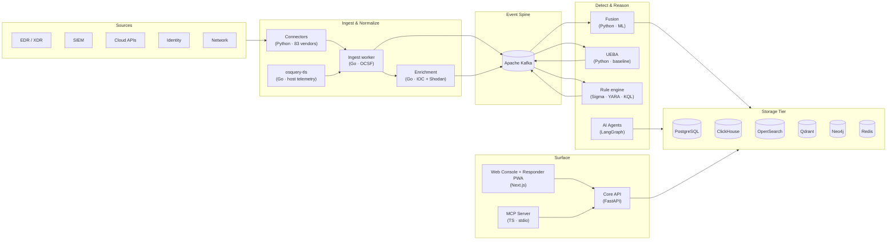
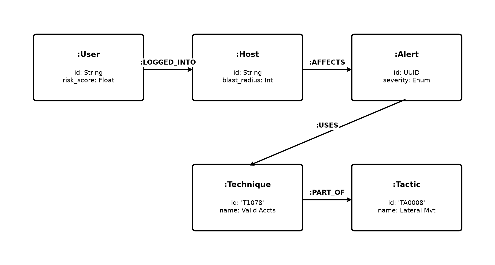
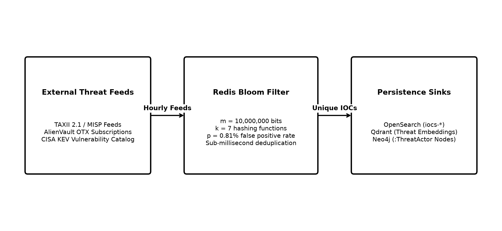
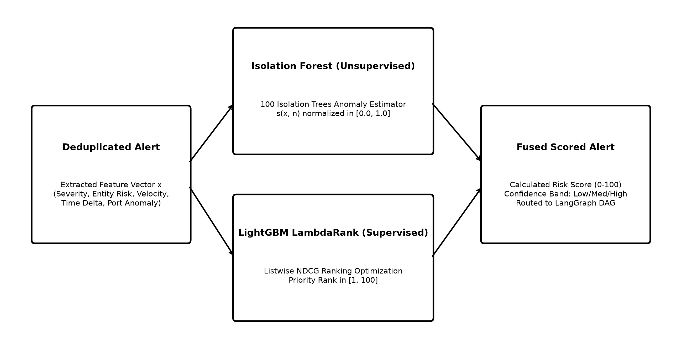
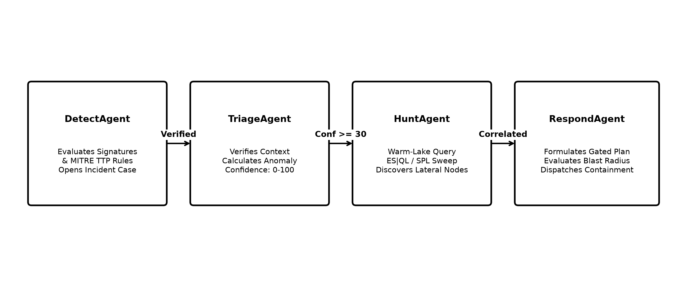
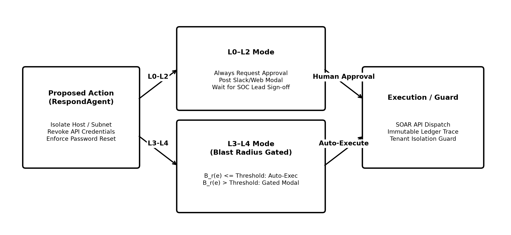

# AiSOC System Design

This document describes the end-to-end architecture of the AiSOC platform after the v2 enterprise upgrade. It covers data flow, the new knowledge graph, the detection rule engine, the threat intelligence pipeline, and the ML-augmented alert fusion pipeline.

---

## 1. High-level Topology



---

## 2. Service Responsibilities

| Service | Language | Hot path | Async path |
|---------|----------|----------|------------|
| `services/ingest` | Go 1.21 | Normalize raw events → OCSF, tag ATT&CK, enrich Shodan | Emit `vulnerability.matches` topic |
| `services/enrichment` | Go 1.21 | Per-IOC TTL-cached enrichment lookups | n/a |
| `services/fusion` | Python 3.11 | Simhash dedup → correlation → ML scoring → publish fused alerts | Background ML retrain on feedback |
| `services/api` | Python 3.11 | REST + WS, RBAC, case mgmt, rule engine, graph queries, ITSM webhook inbox, case fan-out | Schema migrations on boot |
| `services/connectors` | Python 3.11 | 83 connector classes, APScheduler poll, `push_case` / `push_status_change` for Jira & ServiceNow | CredentialVault decrypt at poll time |
| `services/agents` | Python 3.11 | LangGraph multi-agent investigation runs | Loads full ATT&CK STIX bundle on boot, optional Qdrant embed |
| `services/actions` | Python 3.11 | SOAR action execution with blast-radius gating | Approval workflows |
| `services/threatintel` | Python 3.11 | IOC/actor search API | APScheduler poll loop for TAXII/MISP/OTX/KEV |
| `services/ueba` | Python 3.11 | Welford / Z-score user-behavior analytics, peer-group baselines | Background baseline rebuild |
| `services/honeytokens` | Python 3.11 | Deception platform: mints AWS keys, doc lures, DNS canaries; emits `honeytoken.tripped` | n/a |
| `services/purple-team` | Python 3.11 | Adversary emulation orchestrator (ATT&CK technique runner) | Detection-coverage scorer |
| `services/osquery-tls` | Go 1.25 | TLS server for osquery enrol / config / distributed / log endpoints | Ships normalised host events into `services/ingest` |
| `services/osquery-extensions` | Go 1.25 | Out-of-band osquery extensions (custom virtual tables + decorators) | Loaded by `osquery-tls`-managed agents |
| `services/slack-bot` | Python 3.11 | ChatOps surface: posts approval prompts, `/aisoc` slash command | Verifies inbound interactions with HMAC-signed Slack request signatures |
| `services/realtime` | Node 20 | WebSocket fan-out + Web Push for the web console + Responder PWA | n/a |
| `services/mcp` | Node 20 (TypeScript) | Model Context Protocol stdio server, 13 tools for IDE-side agents (Claude / Cursor / Continue / Cody) — discovery, deep-dive, action/replay, and the warm-tier lake query pair (`aisoc_lake_schema`, `aisoc_lake_query`) | n/a |
| `apps/web` | Next.js 14 | Server components + SWR + Responder PWA route group + benchmark scoreboard | n/a |

---

## 3. Knowledge Graph (Neo4j)

The knowledge graph is the connective tissue between alerts, entities, and the MITRE ATT&CK matrix.


*Figure 3: Neo4j Knowledge Graph Schema with Kill-Chain Attack Traversals*

### 3.1 Node Labels

| Label | Key | Purpose |
|-------|-----|---------|
| `Host` | `id` (host UUID or hostname) | Endpoint context |
| `User` | `id` (sub or upn) | Identity context |
| `Alert` | `id` (alert UUID) | Detected event |
| `Case` | `id` (case UUID) | Triage container |
| `IOC` | `value` (sha256/ip/domain) | Atomic indicators |
| `Technique` | `id` (e.g. `T1059.001`) | MITRE ATT&CK |
| `Tactic` | `id` (e.g. `TA0002`) | MITRE ATT&CK |
| `ThreatActor` | `id` | Attribution |

### 3.2 Relationships

```
(Host)-[:LOGGED_IN]->(User)
(User)-[:OWNS]->(Host)
(Alert)-[:ON_HOST]->(Host)
(Alert)-[:AFFECTS]->(User)
(Alert)-[:USES]->(Technique)
(Technique)-[:PART_OF]->(Tactic)
(IOC)-[:OBSERVED_IN]->(Alert)
(ThreatActor)-[:USES]->(Technique)
(ThreatActor)-[:OBSERVED_AS]->(IOC)
(Case)-[:CONTAINS]->(Alert)
```

### 3.3 Critical Queries

* **Attack path** (`get_attack_path`): given a `Case`, traverse `(:Case)-[:CONTAINS]->(:Alert)-[:USES]->(:Technique)-[:PART_OF]->(:Tactic)` ordered by tactic kill-chain index.
* **Blast radius** (`get_blast_radius`): variable-length path query from any entity, capped at 3 hops, filtered by relationship type, used by the `actions` service's gating layer.
* **Entity neighbors**: 1-hop graph used by the SOC console "show context" panel.
* **MITRE coverage**: aggregated counts of distinct techniques observed per tenant per time window.

### 3.4 Bootstrapping

`services/api/app/db/neo4j.py` initializes a singleton `AsyncDriver`, verifies connectivity, and creates uniqueness constraints on `(Host.id)`, `(User.id)`, `(Alert.id)`, `(Case.id)`, `(IOC.value)`, `(Technique.id)` at startup.

---

## 4. Detection Rule Engine

`services/api/app/services/rule_engine.py` implements multi-language rule execution.

| Rule type | Backend | Notes |
|-----------|---------|-------|
| Sigma | `pySigma` → OpenSearch query | Most common path; supports field mappings |
| YARA | `yara-python` | Targets file/memory artifacts |
| KQL | Translated to ClickHouse SQL | For event analytics |
| Lucene / Regex | Direct OpenSearch | For full-text patterns |

### 4.1 Endpoints

| Method | Path | Purpose |
|--------|------|---------|
| `GET /v1/rules` | List rules with filtering | |
| `POST /v1/rules` | Create a new rule | |
| `POST /v1/rules/{id}/execute` | Execute single rule on demand | |
| `POST /v1/rules/hunt` | Multi-rule, time-bounded hunt | |
| `PATCH /v1/rules/{id}` | Update rule (validate, version) | |

### 4.2 Lifecycle

1. Rule authored in the web console IDE (Monaco editor with live test panel).
2. Validated against a sample event; on save, written to `detection_rules` table.
3. Scheduler service evaluates `enabled=true` rules at their cadence.
4. Hits emit fused alert candidates onto Kafka via the `fusion` pipeline.

---

## 5. Threat Intelligence Pipeline

`services/threatintel` runs an APScheduler-driven poll loop with per-feed handlers.


*Figure 5: Threat Intelligence Ingestion, Bloom Filter Deduplication, and Sink Fan-out*

```
TAXII 2.1 ─┐
MISP ──────┤   ┌──────────────────────────┐   ┌────────────┐
OTX  ──────┼──▶│   ThreatIntelPipeline    │──▶│ OpenSearch │
CISA KEV ──┘   │  ─ STIX 2.1 parser       │   │  Qdrant    │
               │  ─ Redis bloom dedup     │   │  Neo4j     │
               └──────────────────────────┘   └────────────┘
```

### 5.1 Components

| Module | Role |
|--------|------|
| `clients/taxii.py` | Async TAXII 2.1 client |
| `clients/misp.py` | MISP REST client |
| `clients/otx.py` | AlienVault OTX client |
| `clients/cisa_kev.py` | KEV catalog fetcher |
| `parsers/stix.py` | Normalize STIX 2.1 SDO/SRO objects |
| `storage/bloom.py` | Redis-backed Bloom filter (configurable size + FP rate) |
| `storage/opensearch.py` | Index `iocs-*` and `actors-*` |
| `storage/qdrant.py` | Embed via `text-embedding-3-large` for semantic recall |
| `storage/neo4j.py` | Persist actor↔TTP and actor↔IOC graph |
| `feeds/scheduler.py` | APScheduler interval jobs |
| `feeds/pipeline.py` | Fan-out to all sinks with idempotency |

### 5.2 Configuration

All feeds toggle via env vars (see [`docs/runbooks/LOCAL_DEVELOPMENT.md`](../runbooks/LOCAL_DEVELOPMENT.md)).

---

## 6. ML-Augmented Fusion

`services/fusion/app/services/ml_scorer.py` adds two scoring dimensions to every fused alert.


*Figure 6: Dual-Stage MLScorer Architecture (Isolation Forest & LambdaRank)*

| Score | Model | Trigger | Cold-start |
|-------|-------|---------|-----------|
| `anomaly_score` | Isolation Forest (sklearn) | Auto-train at ≥50 alerts | Heuristic on event rarity, hour-of-day, severity |
| `priority_score` | LightGBM `LambdaRank` | Trains when ≥100 analyst feedback rows | Heuristic blending severity, anomaly score, asset criticality |

### 6.1 Feature Vector (`_featurize`)

* Numerical: `severity` (1-5), `asset_criticality` (0-1), `hour_of_day` (cyclical), `dedup_count`, `anomaly_score` (when ranking)
* Categorical: top-N MITRE tactic, source product, alert kind (one-hot)

### 6.2 Feedback Loop

1. Analyst submits `POST /ml/feedback` with `is_true_positive` and `assigned_priority` 1-5.
2. Fusion buffers feedback; once buffer ≥100, schedules a background retrain.
3. New model is hot-swapped behind a `RWLock`; old model is retained until validation.
4. `GET /ml/status` exposes counts, last-trained timestamp, buffer size.

---

## 7. AI Agents (LangGraph)

`services/agents` boots with the **full** MITRE ATT&CK STIX bundle and (optionally) embeds it into Qdrant for semantic retrieval.


*Figure 7: LangGraph Multi-Agent Directed Acyclic Graph (DAG) Execution Flow*

### 7.1 Agent DAG

```
PlannerAgent
   │
   ├─▶ EndpointAgent     (CrowdStrike, Velociraptor, GRR)
   ├─▶ IdentityAgent     (Okta, Azure AD, Sentinel)
   ├─▶ NetworkAgent      (Zeek, NetFlow, Darktrace)
   ├─▶ CloudAgent        (AWS, Azure, GCP)
   ├─▶ EmailAgent        (M365 Defender, Gmail)
   ├─▶ ThreatIntelAgent  (calls services/threatintel)
   └─▶ VulnerabilityAgent(reads VULNERABILITY_MATCH stream)
        │
        ▼
   SynthesisAgent ──▶ ActionAgent (with blast-radius gate)
```

Each agent emits chain-of-thought traces persisted in PostgreSQL for explainability.

### 7.2 RAG

* **Threat reports**: indexed by the threat intel service in Qdrant
* **MITRE corpus**: technique descriptions embedded on agent boot (toggle via `ATTCK_QDRANT_EMBED=true`)
* **Internal runbooks**: ingested via `POST /v1/agents/runbooks`

---

## 8. Multi-tenancy & Security


*Figure 8: Blast-Radius Safety Gating Boundary and L0–L4 Approval Mechanism*

* **Tenant isolation** — All Postgres tables include `tenant_id` and are protected by RLS policies.
* **Neo4j scoping** — Every node carries `tenant_id` and queries use `WHERE n.tenant_id = $tid`.
* **Auth** — JWT + API keys; per-tenant scope checks live in `app/api/v1/deps.py`.
* **Audit log** — Every mutating endpoint emits an audit entry to `audit_log` (Postgres) and Kafka.
* **Action gating** — Blast-radius traversal in Neo4j must return ≤ configured cap before high-impact actions execute.

---

## 9. Observability

* **Metrics** — Prometheus `/metrics` on every service; Grafana dashboards under `infra/grafana/`.
* **Tracing** — OpenTelemetry SDK in Python services; Jaeger for visualization.
* **Logging** — `structlog` (Python) + `log/slog` (Go) in JSON for ELK ingestion.

---

## 10. Deployment Topologies

| Environment | Recommended |
|-------------|-------------|
| Dev / demo | `docker compose up` (this repo) |
| Single-cluster prod | Helm chart at `infra/helm/aisoc` |
| Multi-region | Terraform `infra/terraform` + EKS + cross-region MSK |
| Air-gapped | Swap LLM to Ollama-compatible endpoint (`OPENAI_BASE_URL`) |

---

## 11. References

* [API Reference](../api/API_REFERENCE.md)
* [Local Development](../runbooks/LOCAL_DEVELOPMENT.md)
* [PROGRESS.md](../../PROGRESS.md)

---

## 12. v2.1 Additions (Connector Platform, Case Fan-out, Bidirectional ITSM)

The following subsystems were added on top of the v2 design described above. They are additive — none of the previous architecture changed semantically; the data flow into `services/ingest` simply gained two new front doors.

### 12.1 Connector Platform (`services/connectors`)

A first-class, in-process polling tier with **83 registered connector classes** spanning seven categories — `edr`, `siem`, `cloud`, `iam`, `saas`, `vcs`, `network`. Every connector subclasses `BaseConnector` and declares:

* `schema()` — self-describing `ConnectorSchema(name, label, category, fields, oauth, default_poll_interval_seconds)` consumed by the web console for the connect form.
* `capabilities()` — tuple of `Capability` enum values (`PULL_ALERTS`, `PUSH_CASE`, `PUSH_STATUS`, `FEDERATED_SEARCH`, …) that the orchestrator inspects at runtime.
* `normalize()` — collapses each vendor's severity ladder into the four-tier `info | low | medium | high` scheme.

Sensitive `auth_config` fields (marked `secret=True` in the schema) are encrypted at the application layer by `CredentialVault` (Fernet AES-128-CBC + HMAC-SHA256, vault token format `vault:v1:<base64>`). Key rotation is supported via `MultiFernet` with `AISOC_CREDENTIAL_KEY_ROTATION_FROM`. The API service holds the encrypt/decrypt keypair authority; `services/connectors` ships a vendored read-path `decrypt_dict()` so the scheduler can decrypt at poll time without owning the write path.

Polling runs in-process via `ConnectorScheduler` (APScheduler): one job per enabled instance, 5-minute default cadence, overridable per-instance via `connector_config.poll_interval_seconds`. The scheduler reloads jobs every 30 seconds. Disable in tests with `AISOC_CONNECTORS_DISABLE_SCHEDULER=1`.

Normalized events flow through `IngestClient` to `services/ingest`'s `/v1/ingest/batch` endpoint with an `X-Tenant-ID` header — preserving the OCSF normalization, ATT&CK tagging, and KEV correlation already described in §1.

→ [Connector capability matrix](../../apps/docs/docs/connectors/api-coverage.md)
→ [Credential vault threat model](../../apps/docs/docs/operations/credentials.md)

### 12.2 Universal Capture (`/v1/inbox/...`)

For sources that don't fit a polled connector — internal SIEM forwarders, syslog/CEF gateways, vendor webhooks, email alerts — `services/api` exposes a per-tenant token-authenticated webhook inbox. Each token is bound to a `template_id` (`generic-json`, `cef`, `splunk-hec`, `dns-zonefile`, `itsm-inbound`, …) that controls how the body is parsed before it hits the same OCSF normalizer.

Tokens are minted via `POST /v1/inbox/tokens`, stored hashed (never plaintext), and rate-limited per token. The HMAC verification path (`X-AiSOC-Signature: sha256=<hex>`) is shared between universal capture and the ITSM inbound webhook described in §12.4.

### 12.3 Tenant Lake API

A scoped, tenant-isolated query surface over the OpenSearch `events-*` indices. Every query is rewritten to inject `tenant_id` as a top-level filter before reaching OpenSearch — defense in depth on top of the existing index-level RBAC. Query timeouts and result-size caps are enforced per-tenant.

### 12.4 Case Fan-out and Bidirectional ITSM (WS8)

AiSOC is the **source of truth** for case state. ITSM systems (Jira, ServiceNow) are projections — analysts working in their familiar ticket UI still see correct context, but the canonical state lives in AiSOC.

**Outbound (AiSOC → ITSM):** When a case is created or its status changes, `services/api/app/services/case_fanout.py` looks up every connector instance the tenant has enabled with `Capability.PUSH_CASE` (or `PUSH_STATUS`) and projects the change. Successes write a row to `case_external_refs (case_id, connector_id, external_system, external_id, external_url, external_status, last_synced_at)` so subsequent updates target the correct external record. Failures are logged but never block the AiSOC case write — the canonical state is already durable.

**Inbound (ITSM → AiSOC):** A public-facing webhook at `POST /v1/inbox/itsm` accepts Jira and ServiceNow status-change payloads. The endpoint:

1. Verifies the per-tenant HMAC (`X-AiSOC-Signature`).
2. Parses the vendor-specific payload (`issue.key` + `issue.fields.status.name` for Jira; `sys_id` + `state` for ServiceNow).
3. Maps the vendor status into the AiSOC enum via `_JIRA_INBOUND_STATUS` / `_SNOW_INBOUND_STATUS`.
4. Looks up the matching `case_external_refs` row to find the AiSOC `case_id`.
5. Idempotently applies the status change to the AiSOC case (no-op if the case is already in that state).

The mapping is intentionally lossy in one direction: vendor-specific fields (Jira priority, ServiceNow assignment_group, etc.) are **not** synced back into AiSOC. The contract is "case status converges, ITSM-specific metadata stays in ITSM."

→ [ITSM as a projection of AiSOC (full architecture doc)](../../apps/docs/docs/architecture/itsm-as-source-of-truth.md)

### 12.5 Test Coverage

The v2.1 surfaces ship with focused unit tests rather than mocked integration tests against live vendor APIs:

| Surface | Tests | Location |
|---------|-------|----------|
| Inbound ITSM webhook | 69 | `services/api/tests/test_inbox_itsm_endpoint.py` |
| Case fan-out | 21 | `services/api/tests/test_case_fanout.py` |
| `push_case` / `push_status_change` (Jira + ServiceNow) | 23 | `services/connectors/tests/test_push_capabilities.py` |
| **Total** | **113** | |

All 113 are passing on the current `main`. Vendor HTTP calls are mocked at the `httpx.AsyncClient` layer; database calls are mocked at the SQLAlchemy `text(...).bindparams(...)` layer with a `_bind_params` helper that tolerates SQLAlchemy 2.x.

### 12.6 Plugin SDK and Marketplace

Connectors are also the unit of distribution. Every connector ships a marketplace manifest at `plugins/<connector-id>/plugin.yaml` mirroring its `schema()`. The marketplace index at `marketplace/index.json` is synced to `apps/web/public/marketplace/` via `pnpm marketplace:sync` and consumed by the in-app connector picker. Third-party authors can ship plugins via the same SDK without modifying core.

→ [Plugin SDK (Python)](../../apps/docs/docs/plugins/python-sdk.md)
→ [Plugin SDK (Go)](../../apps/docs/docs/plugins/go-sdk.md)

---

## 13. v2.2 Additions (Endpoint Telemetry, ChatOps, Responder PWA, MCP, One-Click Install)

The v2.2 increment is scoped to first-mile ergonomics — getting events into AiSOC from every realistic source, getting analysts out of the console for routine approvals, and getting the entire stack onto a freshly-imaged laptop in one command.

### 13.1 Endpoint Telemetry (osquery TLS server + extensions)

`services/osquery-tls` is a Go TLS server that implements the four osquery endpoints — `/enroll`, `/config`, `/distributed/read`, `/distributed/write`, `/log` — so that any host running osquery can be enrolled into AiSOC with a single enrol secret. Result rows are normalised into OCSF and shipped to `services/ingest`'s `/v1/ingest/batch` endpoint, sharing the same KEV correlator and ATT&CK tagger described in §1.

`services/osquery-extensions` registers custom virtual tables and decorators that the standard osquery distribution doesn't ship — for example, AiSOC-specific process-lineage and EDR-correlated host metadata — and is loaded out-of-band by agents managed by `osquery-tls`. The split (server vs extensions) keeps the TLS server's surface area minimal and lets the extensions iterate without touching the enrol path.

This makes AiSOC self-sufficient for endpoint telemetry: a tenant who doesn't own a CrowdStrike or SentinelOne licence can still get host events into the platform without standing up a separate fleet manager.

### 13.2 ChatOps (`services/slack-bot`)

A first-class Slack surface that closes the loop on the action-gating layer described in §8. When `services/actions` requires approval for a high-blast-radius action, the slack-bot posts an interactive message into the configured channel; an authorised approver clicks the button; Slack posts back to the bot, which verifies the request with an HMAC-signed Slack signature and forwards the approval to the actions service. The bot also exposes a `/aisoc` slash command for ad-hoc queries (case lookup, ledger snippet, IOC reputation).

Crucially, **AiSOC remains the source of truth** — Slack is a projection. If the bot is offline, approvals fall back to the web console with no state divergence.

### 13.3 Responder PWA

A route group inside `apps/web` (Next.js 14) registers as an installable PWA targeted at on-call responders. It connects to `services/realtime` for WebSocket case updates and accepts Web Push notifications from the same service, so a responder can be paged on their phone with a tappable approve / deny / escalate prompt without opening the desktop console. The full set of console actions is available offline-tolerant: actions queued while disconnected are replayed when the WebSocket reconnects, with optimistic local state and server-side conflict resolution.

### 13.4 Model Context Protocol Server (`services/mcp`)

A TypeScript stdio MCP server that exposes 11 AiSOC tools (case search, alert detail, IOC pivot, ledger query, detection-as-code lookup, …) to IDE-side AI agents — Claude Code, Cursor, Continue, Cody. This makes AiSOC a first-class context source for any analyst writing detections, runbooks, or post-mortems in their editor. The MCP server is read-only by default; write tools require an explicit per-tool capability token.

### 13.5 Investigation Ledger and Ambient Copilot

Every prompt, tool invocation, and agent step inside `services/agents` is persisted into the **investigation ledger** — a per-case, append-only log that is replayable end-to-end. The ledger is the substrate for the Ambient Copilot in `apps/web`: a sidebar that shows what the agent is doing right now, why it picked the next tool, and what the analyst can do to redirect it. Combined with the LangGraph DAG in §7, this gives AiSOC a debugging surface for AI-driven investigations that mirrors the kind of structured logging analysts already expect from deterministic systems.

### 13.6 One-Click Install Pipeline

Two cross-platform bootstrap installers live at the repo root:

* `install.sh` — Linux + macOS bash; supports `apt`, `dnf`, `pacman`, `zypper`, `apk`, and `brew`. Idempotent; safe to re-run.
* `install.ps1` — Windows PowerShell; uses `winget` and handles WSL2 enablement for Docker Desktop.

Both detect the OS, install missing prerequisites (git, Docker Engine + Compose v2 / Docker Desktop, Node.js 20 LTS, pnpm 8+ via `corepack`), clone the repo into `~/aisoc`, then invoke `pnpm aisoc:demo` to bring up the slim demo stack from the published GHCR images and open the browser at the seeded LockBit case. Companion uninstallers (`uninstall.sh`, `uninstall.ps1`) provide graduated cleanup — stop stack only, drop volumes, remove pulled images, delete `node_modules`, delete the repo clone — gated behind interactive confirmation prompts unless `--all --yes` is supplied.

→ [One-click install (Docusaurus)](../../apps/docs/docs/installation.md)
→ [Quick install reference](../QUICK_INSTALL.md)

### 13.7 Updated Service Inventory (post v2.2)

The full set of services in `services/` after v2.2 is:

```
actions/          agents/           api/              connectors/
demo-producer/    enrichment/       fusion/           honeytokens/
ingest/           mcp/              osquery-extensions/  osquery-tls/
purple-team/      realtime/         slack-bot/        threatintel/
ueba/
```

17 services in total. The `mcp/`, `osquery-extensions/`, `osquery-tls/`, and `slack-bot/` directories are the v2.2 additions; the rest are described in §2 and §12 above.

